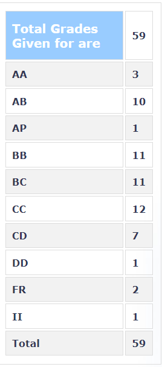

### PH410 – Statistical Physics

**Your Name and Batch:**

 Prakhar Bansal(2024, B.Tech)

**Course Offered In:**

 Spring 2022

**Instructors:**

 Prof Mithun Mitra

**Prerequisites:**
 PH 251(Classical Mechanics), PH 204 (QM I)(Can be managed even without it)

**Difficulty:**

 Moderate

**Course Content:** 

Refer ASC

**Feedback on Lectures:**
Most of the lectures are quite heavy in terms of the content so try to pay attention in the class.

**Feedback on Evaluations:**

Weekly SAFE Quizzes (70%) +Endsem (30%) Tutorial Problems are moderate to difficult.

**Grading Statistics:** 

**Study Material and References:** 

(i)Mehran Kardar, StatisticalPhysics of Particles

**Follow-up Courses:** 

PH 543 Advanced Stasticial Mechanics

**Final Takeaways:** 

Can be a good substitute of PH 253