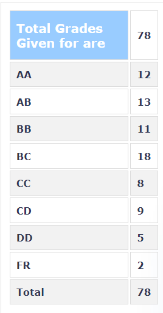

**Your Name and Batch:**

Siddhant Midha, 2024 (EE BTech)

**Session:**

Spring 2023

**Instructor:**

Prof. Himadri Dhar

**Prerequisites:**

Linear Algebra and Quantum Mechanics

**Difficulty:**

Moderate

**Feedback on lectures:**

This course, titled “Quantum Information and Computing” is an introductory course which covers the foundations of QIC, ranging from the fundamentals of quantum algorithms to the essential principles of quantum information. The course starts with the first module -- an introduction to the language of quantum information (qubits, density matrices, measurements) accompanied by a recap of basic QM. This was followed up by discussions of opan and composite quantum systems, and quantum operations (different representations, particularly kraus; choi isomorphism; examples of quantum channels). Then the second module is primarily concerned with the notions of entropy (shannon entropy, relative entropy, von-neumann entropy, properties) and quantum entanglement (definition, measures of entanglement, entanglement as a resource). This was supplemented by brief discussions on quantum distance measures and very interesting points about the geometry of the quantum state space with notions such as entanglement witnesses. The last and final module was about "computing quantumly" -- quantum algorithms (different primitives and examples) and quantum communication protocols. This module emphasized that computation is physical, and stressed on the implications of doing so with the principles of quantum mechanics. In the end, we also briefly talked about some quantum cryptographic protocols (BB84).
The initial part of the course was fully online, but towards the end we had hybrid classes. The lectures were clear and interesting. One could ask questions in between, and the professor made sure to clear all doubts. We routinely stayed back after the official lecture timings for additional discussions.

**Feedback on tutorials and exams:**

We had a midsem exam (30%), an endsem exam (40%), a quiz (15%) and an assignment (15%). The exams were strictly based on what was taught and were on the relativily easy to moderate side. The evaluations were fair. The assignment held very interesting problems which required both analytical solving as well as using computer programs. The evaluation was again fair. 

**Grading Statistics:** 

**Textbooks & References:**

The primary reference is the book on quantum computation and information by Nielson and Chuang. The professor also provides handwritten notes, which define the syllabus for the course.