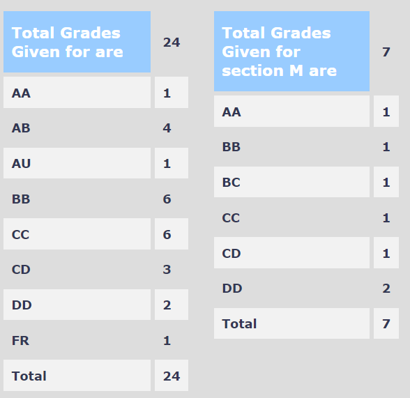

### SC602 - Control of Nonlinear Dynamical Systems (2020)

**Course offered in:**
Spring 2020
**Instructors:**
Prof. Srikant Sukumar

**Course Content:**
- Analysis:
  - Nonlinear Systems introduction + examples Lyapunov Stability definitions
  - Lyapunov theorems
  - Invariance theorems
  - Input Output stability
- Design:
  - Lyapunov re-design
  - Backstepping design
  - Feeedback Linearization
Started off with the basics of Nonlinear systems, going through various definitions with respect to stability, specifically Lyapunov Stability and then progressing to advanced concepts of Input/Output Stability. 
These definitions were used to discuss the design of various controller designs and evaluated for different systems.

**Prerequisites:**
Hard Prereq of SC639 + SC201.
From the prof:- “Graduate level competence in ordinary differential equations and linear systems/control theory is expected”.
I would recommend a working knowledge of differential calculus and mathematical argument.

**Feedback on Lectures:**
With the online semester, the course material was presented as pre-recorded lectures which were expected to be watched before the weekly discussion session. You could watch at your own pace and the material was never longer than an hour/hour and a half or so per week. The content was fairly easy to follow with plenty of examples and references from textbooks. Any vestigial doubts were always covered thoroughly in the weekly doubt discussion sessions.

**Feedback on Tutorials, Assignments and Exams:**
Each week there was a graded homework assignment, released along side the video content of that week. These assignments were fairly easy if you understood the content for that week. The submission deadline was always post a doubt discussion session for any issues that might have come up. These combined contributed to 50% of your grade. 

There was a midsem and endsem of 25% each. Both were oriented towards problem solving and concept implementation rather than focussing on definitons and obscure mathematical proofs. Again, if you followed the content, these were fairly easy to tackle. However, in my opinion, the time provided was a bit too short.

**Grading Statistics:**

**Difficulty:**
3/5

**Study Material and References:**
- H.K. Khalil, “Nonlinear Systems,” Third edition, Prentice Hall, 2000.
- M. Krstic, I. Kanellakopoulos, P. Kokotovic, “Nonlinear and Adaptive Control Design,” John Wiley & Sons, Inc., 1995.
- A . Isidori, “Nonlinear Control Systems,” Third edition, Springer-Verlag, 1995.
- M. Vidyasagar, “Nonlinear Systems Analysis,” Second edition, Society for Industrial and Applied Mathematics, 2002.
Out of these, Khalil and Vidyasagar will be your best friends for this course. Often, the weekly problems were straight out of these textbooks.

**Follow-up Courses**
SC617, SC618

**Final Takeaways**
Overall, a really good course with real insight into the variety of different controllers used leeway into modern control as well. The professor also teaches very well with clear definitions and teaching style along with many real-life examples to relate to. 

Review by - Nishant Mittal, 2023 (BTech)