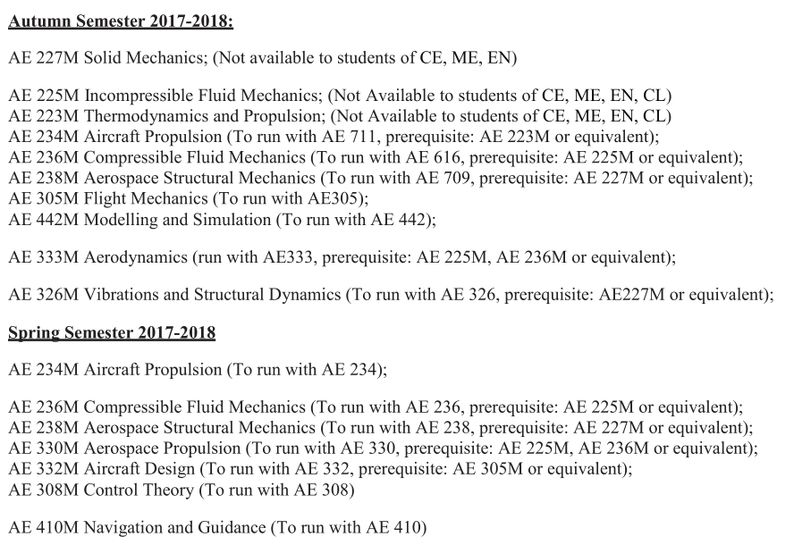

### AEROSPACE MINOR

_Written by Sai Anirudh M, B.Tech 3rd year (July 2021)_

The Aerospace minor is rather unique and different from most of the popular, more sought after minor programmes. Since there doesn’t seem to be a review of the minor in the recent years’ Course Information Booklets, I shall take the liberty to be a bit elaborate on the programme itself. But I would like to preface this by saying that this minor is highly flexible and relatively unstructured, so it is highly unlikely that your experience with the minor will be the same as mine. Even so, I will try to cover the possible scenarios and what you should know and expect from this minor. Also part of the preface: do this minor only if you are interested in aerospace, and want to learn more about subsystems of aviation, without expecting it to “qualify” you for anything more than a minor degree (in my opinion, this should hold true for any minor). 

The first course of the minor, which is the only compulsory course and a prerequisite for all other courses, is called AE153: Introduction to Flight. Whether or not you decide to complete the minor later, I think this is a very interesting and informative course that anyone with even an inkling of curiosity or fascination for aviation, should do. You are taught the basic principles of flight, using simple equations and plenty of illustrations. There is generally plenty of audio-visual content, and lectures at times seem more like scientific documentaries. While I did this course offline, there were three course projects as well that were quite fun and hands-on (one of them involved a glider competition). However, if there is a downside to this course at all, it’s the grading: probably one of the harshest I have seen, though you might like to confirm this for yourself from ASC. 

As for the remaining courses of the minor, there is a huge list to choose from. Here is the list from a previous year (you can expect it to be nearly the same):-

Nearly every course that is offered as part of the minor runs concurrently as a core course for Aerospace UGs. However, this also means that none of them actually runs in slot 5, like most minor courses do. Very often, most of the minor courses offered in a semester clash with one of our own core courses, and you are only left with one (two if you are lucky) course to choose from. I hope you now see why I said your experience with the minor may not be similar to mine. 

Given the choice, there are roughly two paths one could take to complete a minor in Aerospace. The first is the “full flavour” path. If you haven’t noticed already, there are roughly four fields under Aerospace Engineering: Aerodynamics, Structures, Propulsion and Dynamics/Control. In this path, one would take up the introductory courses to each of these fields (including 223, 225, 227, and whatever else you can get your hands on). A lot of the higher courses have these courses as prerequisites anyway. Naturally the second path would be to identify one of the fields as your interest and start doing only those courses, starting from the first prerequisite. Stating the obvious, a lot of EE students might not find “merit” in studying one of Aerodynamics, Structures and Propulsion, but if one of them is particularly an area of interest for you, then by all means make use of the opportunity to study it. 

This leaves Dynamics and Control, which is potentially the most relevant part of the minor to an EE student. These courses include Spaceflight Mechanics, Flight Mechanics, Control Theory, Modelling and Simulation, and Navigation and Guidance. The great part is that none of these courses has any hard prerequisite other than AE153 itself, so you can do them in any order you like. Let me talk about the courses I have completed myself. 

Flight Mechanics: This course is a continuation of AE153 and deals with a lot more equations governing flight. You will learn about stability and trim conditions, physical control of the aircraft, dynamic stability and control, manoeuvres, etc. It’s rather Physics (Classical Mechanics?) intensive, but it really drives the understanding of flight and control principles into mind. 

Modelling and Simulation: This course is useful in general for most branches of engineering, and teaches principles behind modelling systems (Hydraulic, Mechanical, Thermal, Electrical) and analysing them. Equations of motion and coordinate systems are also part of the curriculum, followed by an introduction to Multirotor systems. Towards the end there was also a brief introduction to AI and ML by a guest lecturer (but believe me when I say brief). 

Control Theory: I did not do this course from AE, but it is equivalent to EE302 (Control Systems), so there’s really no need to do AE308 separately. If it is ever enforced as a prerequisite (which I don’t think it has been so far), you should be able to get around it if you’ve done EE302 by then. 

Apart from this, I had the chance to do the course Aircraft Design, which is a topic independent of the four fields above (or rather, a combination of all of them). It is a unique course that teaches design principles and ideas, and is highly based on practical experience and history. The content is suited for the aerospace industry and can be somewhat dry to someone without context. Nonetheless, it is quite informative, refreshingly different from other engineering courses and should be interesting to an aircraft enthusiast.
