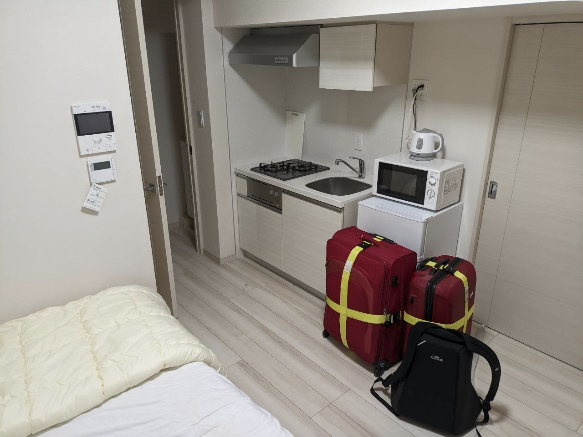

### Basic Information

- **Name** M Shashank Balaji
- **Curriculum:** EE BTech
- **Year of Study:** 4th
- **Company/University of Internship:** Sony Japan
- **Year of Internship (eg. \'23 Summers, \'22 Winters):** '23 Summers
- **Mode of Internship (Online/Offline/Hybrid):** Offline
- **Duration of Internship:** 2 Months

### Getting into the Internship:

#### What specific domain or field did you target to get an internship in?
My interest is in software, specifically, operating systems, embedded systems, etc. Basically, low-level stuff. So I applied for software profiles.

#### What resources did you utilize to prepare for the tests/interviews?
For my profile, Sony had SoP + resume filtering followed by an interview. For some profiles, like ML, Sony has a coding test as well. For me, the interview was easy: just 20m, and only technical. I was asked about my experience using Linux, my overall programming experience, and some details about some relevant projects. I did not prepare particularly for the interview. Sony, unlike other software companies, does not focus on DSA. Due to my interest, over the past two years, I had been learning about Linux and operating system stuff, which helped me in the interview. I didn’t following any book or source. I just google stuff I don’t know.

#### Can you elaborate on your interview and the type of questions which were asked?
The interview is online, and is conducted by the Japanese members of Sony (usually). So their accent might be a bit difficult to understand, as we are not used to it. It’s recommended to speak slowly, clearly and in an easy way, since they are not used to our accent. I was not asked any HR questions, but some of my friends were. It’s highly dependent on the interviewers, who are different for each profile.

#### Were there any significant roadblocks or challenges that you encountered during the internship application and selection process? If so, how did you navigate or overcome them?
I was interested in software, so I applied to only those profiles. I guess I face the same problems that everyone else faces: grinding DSA, haha. I hate doing that, because of which my preparation wasn’t up to the mark of most companies. Thankfully, Sony does not give much importance to DSA.

#### How did you handle any rejections that you faced (If any) during the internship application process?
I faced rejection from all the companies before Sony; all the big names like Google, Amazon, Samsung, etc. I couldn’t even get past the coding tests. The mood was gloomy, but my type is to not worry about the results, and to just give my best at each stage. But it was difficult for me as well. I clearly remember being shattered after Samsung’s coding test. I did not see the dumb brute force solution that was right in front of me, and I wasted a lot of time on a question. One of my best friends was there for me during that time. So, I’d say, people are important during these times. You’ll need them during the difficult times.

### During the internship:

#### What was your specific profile or project topic during the internship?
My work was in Linux kernel development. Sony has a proprietary technology in the Linux kernel (the kernel itself is open source), and my job was to enhance it by integrating with an existing kernel subsystem. I did not have prior kernel development experience. So it was slightly difficult initially, but my general programming experience guided me through the project. My mentor was of immense help as well.

#### How would you describe your overall experience as an intern?

My internship experience was amazing. I loved the work there. And since it was in Japan, work was not the only aspect of the internship, and this was made very clear even by my manager and HR. They suggested me places to visit in Japan, and after every weekend, many team members would ask me what I did over the weekend. Japanese people are polite in general, and that translates to the work place as well. People are very well mannered, disciplined, and timely. It certainly made me more disciplined. During my internship, Sony was transitioning from work-from-home to work-from-office. As such, employees were required to come to the office only once a day. So on most days, I used to be alone in my work area, chatting with my mentor online, and having online meetings. So I didn’t get to have a lot of interaction with the team members. But still, it was fun.

Along with work, was the aspect of living alone. Sony provides accommodation, and pays for the transit to-and-from the office. The apartment given to me was amazing. Since I wanted to save some money, I used to cook breakfast and dinner on weekdays, and eat out on weekends. If you’re a vegetarian, it can be a bit of a problem, since most food items in Japan have pork, beef, chicken, or sea food (tuna, salmon, octopus, shrimp, etc.). That’s not to say that it’ll be unlivable for you. My mentor himself was vegetarian, and he cooked himself. One of my co-interns was vegetarian as well. There are vegan options at restaurants, but it takes a bit of searching to find them.

Now about living in Tokyo. The train connectivity is marvelous. There are convenience stores at every block of the country. Japan is primarily a cash based society, although, that is changing with the introduction of e-currency cards. So make sure you take enough cash with you. Oh, have a forex card as well, or an international debit card, but forex is recommended. Sony gives a pocket WiFi. So no need to buy a Japanese SIM card. There are an immense number of places to explore in Japan. Plan well, work during weekdays, and enjoy during weekends :)

#### Could you provide insights into the organizational culture of the company/university and what your peers were like?
 was assigned a mentor and a manager. The mentor’s job was to guide me technically, and the manager’s job was to take care of the administrative stuff, and my life in Japan in general. The other team members were friendly. They were keen to talk to me, and to know what I had explored in Japan. Japanese people really appreciate it even if you know very little Japanese. As interns, you’re not expected to know Japanese, but they’ll be pleased if you’ve put the effort to learn :)

#### Were there any networking opportunities or professional connections that you established during the internship?
Yes, there was a networking event organized by the HR. It was meant for the international interns to get to know each other. It was nice meeting people from all over the world. I made some friends too!

### After the Internship:

#### Based on your experience, would you recommend this internship to others interested in the same field? If so, what aspects make it worth recommending? If not, what factors influenced your perspective?
I would highly recommend this internship to other interested in my field, or any of the other profiles offered by Sony. My experience at the workplace was amazing. But it should also be noted that it depends on the team in which you’re accepted into. Because some of my co-interns were in a different department and they didn’t have as good of an experience as me. Then there’s the experience of living alone in a foreign country. It was the first for me, and I loved it. Japan is a beautiful and peaceful country to live in. The language barrier and cuisine might be a bit of a problem for us. I used a lot of Google Translate, and I had my co-interns from India to travel with. All in all, I believe I grew as a person, and I would recommend it to anyone interested.
